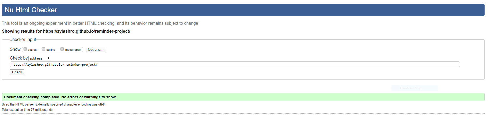

[Live Site](https://zylashro.github.io/reminder-project/)

# Task Meister

This project is designed as an alert system website that notifies the user when one of their reminders expires. The project serves to demonstrate my ability to JS and make an interactive front-end project.

## Table of Contents

1. [**Project**](#project)
2. [**UX**](#UX)
    - [**User Stories**](#user-stories)
3. [**Features**](#features)
4. [**Technologies**](#technologies)
5. [**Testing**](#testing)
    - [**HTML Validator**](#html-validator)
    - [**CSS Validator**](#css-validator)
    - [**Browsers**](#browsers)
6. [**Deployment**](#deployment)
7. [**Self-Reflection**](#self-reflection)
8. [**Credits**](#credits)
    - [**Icons**](#icons)

## Project

The project was made to demonstrate the knowledge I've acquired throughout the Code Institute Full Stack Developer course thus far. With the goal of making a responsive and interactive website.  

This project is a single page website that I am using to display my skills and knowledge when it comes to interactive front-end development. 

## UX

### User Stories

- The user is able to know how to use the app with a clear and upfront "How To Use" section.
- The user is able to add a reminder with an eye-catching and visible button.
- The user is able to both name, and set the expiration date for each individual reminder.
- The user is able to click the name of each reminder to see a popout with the full reminder name in case the set name is too long.
- The user is able to know when a reminder was created.
- The user is able to see when a reminder had expired.
- The user is able to see a live countdown for each reminder.
- The user is able to remove a reminder.
- The user is able to mark a reminder as "done".
- The user is able to see when they marked a reminder as "done".
- The user is able to see all their reminders—expired, done, and still running—in their own separate lists.
- The user is able to remove the entire list, and with it all the reminders within, instead of having to remove each reminder individually.
- The user will be notified by the site when a reminder has expired.
- The user is able to see that a reminder has expired by a change in the tab title documenting how many reminders had expired.
- The user is able to have their device turned-off without worrying that reminders will stop counting down.

## Features

1. Responsive design.
2. Form popout.
3. Form validation.
4. Dynamically created reminders.
5. Dynamically created lists.
6. Live countdown.
7. Ability to remove either an individual reminder or entire list.
8. Ability to mark a reminder as done.
9. Reminders are saved to the local storage, allowing the site to keep its intended functionality even if the user has closed the tab or turned-off their device.
10. Ability to clear the local storage by removing reminders.

## Technologies

For this project, I used a number of technologies to help me finish.

- **HTML5:** Modern HTML to form the structure of the site.
- **CSS3:** Used to style the site along with Flexbox and Grid.
- **JS:** Used for the logic between HTML elements and interaction between the user and the site.
- **React:** A JS library used to ease the development cycle of the dynamically generated UI elements and the logic behind them.
- **Git:** Used for version control from the very beginning of the project.
- **Github:** A remote repository used to store the source code for the project.
- **Github Pages:** GitHub's own hosting service used to deploy the project.
- **VsCode:** Source code editor used to write, edit, test, and debug the source code.

### Dependencies

Along with the various technologies used to make this project, I had to resort to external React dependencies to help with the trickier and more tedious parts of the project.

- **[React-datepicker](https://github.com/Hacker0x01/react-datepicker):** A neat dependency which is responsible for the date-picker on this project.
- **[React-icons](https://react-icons.github.io/react-icons/):** The dependency responsible for the implementation of all the icons used in the project.
- **[React-web-notification](https://github.com/mobilusoss/react-web-notification/tree/develop):** The dependency used for creating the web notification the user gets when one of their reminders expires.
- **[Testing Library](https://testing-library.com/):** The testing dependency used to create the tests for this project.

## Testing

### HTML Validator

The result of the HTML Validator can be seen in the image below:

### CSS Validator

The results of the CSS Validator can be seen in the image below:

Note!: On inspection of the errors, it seems that every error is related to CSS variables that I used to make the switch between light and dark more easier.

### Browsers

The website was tested on these browsers:

1. Chrome

## Deployment

The deployment of the project was done entirely with **GitHub Pages**.

The published source code can be found in [**this repository**](https://github.com/Zylashro/barbershop).

And the finished, live website can be found [**here**](https://zylashro.github.io/barbershop/).

## Self-Reflection

Much like the previous milestone project, I was a bit lost on ideas of what I could do. With the help of my mentor, I decided to make a website that would notify the user of when they should take their medicine. It's safe to say that that idea had changed a bit.

While the core concept of an alert system site still persists in this iteration, I reconsidered the specific functionality of the whole project. Instead of having a specific use, I opted to make it a more general alert system.

But, by the far the biggest change to come to this project was the decision to use React. 

Originally this project started out in vanilla JS and close to a week into the development, I had a friend recommend that I use React after hearing just what I was trying to do. His reasoning? React more or less excels at the type of dynamic UI generation which I required. I took two weeks reading the React documentation, and all kinds of articles and videos I could find to bring me up to speed with all the relative information for my project as well as playing around with code. And I firmly believe that the results speak for themselves.

My only real regret with the project is the testing. For some reason, the entire TDD implementation completely flew over my head. I tried to get a good understanding of it, but it just alluded me. 

If this project taught me anything, is that testing is by far my weakest area and one that I will be actively trying to improve. And that at times you have to switch tools to the ones more geared towards what you want to accomplished with a project and what you require in order to see it to fruition. 

## Credits
This project would not have been possible without the following:

### Icons

The icons used in this project were pulled over from [React-icons](https://react-icons.github.io/react-icons/).