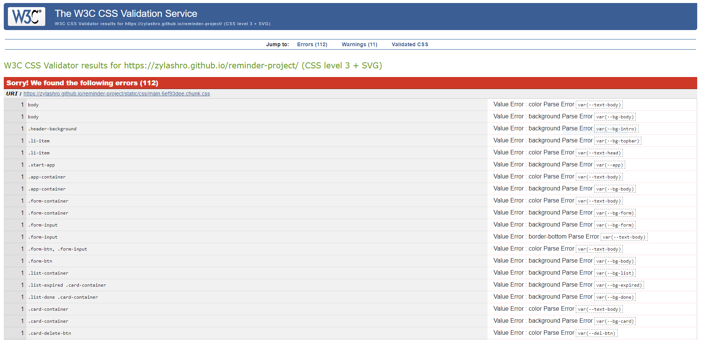

[Live Site](https://zylashro.github.io/reminder-project/)

# Task Meister

This project is designed as an alert system website that notifies the user when one of their reminders expires. The project serves to demonstrate my ability to JS and make an interactive front-end project.

## Table of Contents

1. [**Project**](#project)
2. [**UX**](#UX)
    - [**User Stories**](#user-stories)
	- [**Mockup**] (#mockup)
3. [**Features**](#features)
4. [**Technologies**](#technologies)
5. [**Testing**](#testing)
    - [**HTML Validator**](#html-validator)
    - [**CSS Validator**](#css-validator)
    - [**Browsers**](#browsers)
    - [**Automated Testing**](#automated-testing)
6. [**Deployment**](#deployment)
7. [**Self-Reflection**](#self-reflection)
8. [**Credits**](#credits)
    - [**Icons**](#icons)

## Project

The project was made to demonstrate the knowledge I've acquired throughout the Code Institute Full Stack Developer course thus far. With the goal of making a responsive and interactive website.  

This project is a single page website that I am using to display my skills and knowledge when it comes to interactive front-end development. 

## UX

### User Stories

- The user is able to navigate to each individual section of the site by navigation bar in the upper right corner.
- The user is able to collapse any section with the help of a clear arrow button.
- The user is able to know how to use the app with a clear and upfront "How To Use" section.
- The user is able to add a reminder in the "Add Reminder" section.
- The user is able to both name, and set the expiration date for each individual reminder.
- The user is able to set a custom time by deleting the minutes and writing in their desired time instead of choosing the fifteen minute interval.
- The user is able to click the name of each reminder to see a popout with the full reminder name in case the set name is too long.
- The user is able to know when a reminder was created.
- The user is able to see when a reminder had expired.
- The user is able to see a live countdown for each reminder.
- The user is able to remove a reminder.
- The user is able to mark a reminder as "done".
- The user is able to see when they marked a reminder as "done".
- The user is able to see all their reminders—expired, done, and still running—in their own separate lists.
- The user is able to collapse the content of each list to minimize scrolling.
- The user is able to remove the entire list content instead of having to remove each reminder individually.
- The user will be asked if they are sure they want to delete an entire list.
- The user will be notified by the site when a reminder has expired.
- The user is able to see that a reminder has expired by a change in the tab title documenting how many reminders had expired.
- The user is able to have their device turned-off without worrying that reminders will stop counting down.

### Mockup

A link that takes you to the mockup I made for this project. Note, that the links take you to a PDF file and do not display an image.

Note!: The site is suppose to look the same on mobile as on PC which is why there is only one file.

## Features

1. Responsive design.
2. Hide-able information section.
3. Form validation.
4. Dynamically created reminders.
5. Live countdown.
6. Ability to remove either an individual reminder or entire list reminders.
7. "Are you sure?" popout.
8. Ability to mark a reminder as done.
9. Collapse-able list content. 
10. Collapse-able section content.
11. Reminders are saved to the local storage, allowing the site to keep its intended functionality even if the user has closed the tab or turned-off their device.
12. Ability to clear the local storage by removing reminders.

## Technologies

For this project, I used a number of technologies to help me finish.

- **HTML5:** Modern HTML to form the structure of the site.
- **CSS3:** Used to style the site along with Flexbox and Grid.
- **JS:** Used for the logic between HTML elements and interaction between the user and the site.
- **React:** A JS library used to ease the development cycle of the dynamically generated UI elements and the logic behind them.
- **Git:** Used for version control from the very beginning of the project.
- **Github:** A remote repository used to store the source code for the project.
- **Github Pages:** GitHub's own hosting service used to deploy the project.
- **VsCode:** Source code editor used to write, edit, test, and debug the source code.

### Dependencies

Along with the various technologies used to make this project, I had to resort to external React dependencies to help with the trickier and more tedious parts of the project.

- **[React-datepicker](https://github.com/Hacker0x01/react-datepicker):** A neat dependency which is responsible for the date-picker on this project.
- **[React-icons](https://react-icons.github.io/react-icons/):** The dependency responsible for the implementation of all the icons used in the project.
- **[React-web-notification](https://github.com/mobilusoss/react-web-notification/tree/develop):** The dependency used for creating the web notification the user gets when one of their reminders expires.
- **gh-pages:** The dependency required in order to host this project on GitHub Pages.

## Testing

### HTML Validator

The result of the HTML Validator can be seen in the image below:

### CSS Validator

The results of the CSS Validator can be seen in the image below:

Note!: On inspection of the errors, it seems that every error is related to CSS variables that I used to make the switch between light and dark more easier.

### Browsers

The website was tested on these browsers:

1. Chrome
2. Edge
3. Internet explorer

The website works as intended on both Crome and Edge while on IE the site is completely devoid of all its CSS styling.

### Mobile

Testing the UI on various screen resolutions ranging from 360px width screen to the more larger iPhone8 screens have all shown no visible error of any kind.

### Automated Testing

For this project it was asked of me to practice Test Driven Development and use a testing library such as Jasmine, or in the case of React the pre-built-in Jest. It is suffice to say that I did not do so.

While learning React for this project did take away time that I would have otherwise spent on developing tests, I will not use that fact to deflect my own shortcoming in this regard.

For one reason or another, the entire process of writing tests made little sense to me. And by that I mean how one goes about writing tests just didn't click with me. I couldn't wrap my head around how to write tests. Instead of spending a lot of time figuring that out, I pressed on with writing the code, thinking that I'd write some tests after the fact. But, here I am with no tests to show for it.

Looking at my code now, I can't even imagine on where to begin testing or how. I firmly believe that if I had spent some time practicing test writing with some very simple and basic code then this area of the project could have been bettered in every sense of the word.

For the immediate future, I know what I need to work on and how to tackle that issue in order to fill in the gaps in my knowledge.

Saying that, I have manually tested every aspect of the project numerous times without an issue.

## Deployment

The deployment of the project was done entirely with **GitHub Pages**.

In order to deploy the project onto GitHub Pages I had to do the following steps:

1. Created a GitHub account at [**GitHub**](https://github.com/). My account can be found [**here**](https://github.com/Zylashro). 
2. Uploaded all my project files to a GitHub repository designated for the project. The files for this particular project can be found [**here**](https://github.com/Zylashro/reminder-project).
3. Installed the gh-pages React dependency by running `npm install gh-pages --save` in my terminal.
4. Added both `"predeploy": "npm run build"` and `"deploy": "gh-pages -d build"` under scripts in the package.json file.
5. Pushed all necessary changes to the master branch.
6. Ran `npm run deploy` in my terminal in order for React to deploy a stable build of the project.
7. In the GitHub repository of the project, I navigated to the "Settings" tab and scrolled down until I found the section labeled "GitHub Pages".
8. For the source of the page I selected the "gh-pages-branch" which was created in step 4. of the deployment process. 

## Self-Reflection

Much like the previous milestone project, I was a bit lost on ideas of what I could do. With the help of my mentor, I decided to make a website that would notify the user of when they should take their medicine. It's safe to say that that idea had changed a bit.

While the core concept of an alert system site still persists in this iteration, I reconsidered the specific functionality of the whole project. Instead of having a specific use, I opted to make it a more general alert system.

But, by the far the biggest change to come to this project was the decision to use React. 

Originally this project started out in vanilla JS and close to a week into the development, I had a friend recommend that I use React after hearing just what I was trying to do. His reasoning? React more or less excels at the type of dynamic UI generation which I required. I took two weeks reading the React documentation, and all kinds of articles and videos I could find to bring me up to speed with all the relative information for my project as well as playing around with code. And I firmly believe that the results speak for themselves.

My only real regret with the project is the testing. For some reason, the entire TDD implementation completely flew over my head. I tried to get a good understanding of it, but it just alluded me. For more details, I'd recommend reading the [automated testing](#automated-testing) section of the document.

If this project taught me anything, is that testing is by far my weakest area and one that I will be actively trying to improve. And that at times you have to switch tools to the ones more geared towards what you want to accomplished with a project and what you require in order to see it to fruition. 

## Credits
This project would not have been possible without the following:

### Icons

The icons used in this project were pulled over from [React-icons](https://react-icons.github.io/react-icons/).